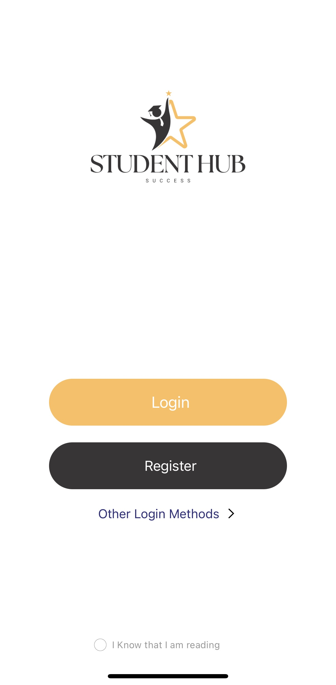

# StudentHub

StudentHub is a mobile app designed to help students connect and share experiences. It features:

- 📌 Category-based posts
- 💬 Real-time chat
- 🗺️ Map-based experience sharing
- 👥 Follow & comment system
- 📱 Built with React Native + Firebase

## Getting Started with work Screen shot

### Home Page

### Login Page

### Home Page

### Article Page

